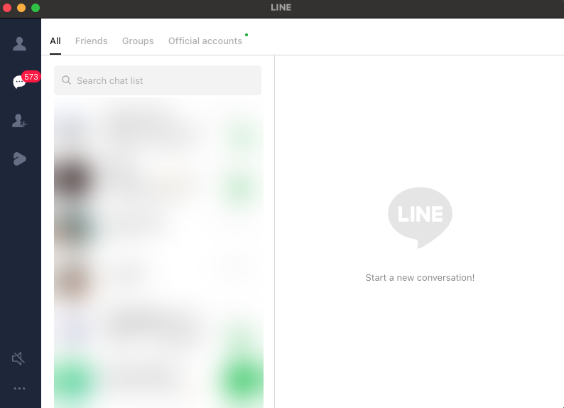

# line-chrome-cli

[English](README.md) | [한국어](README.ko.md) | **日本語**

**公式 LINE Chrome 拡張機能**をコマンドラインから操作する、あるいは AI アシスタントに
操作させるツールです。メッセージ送信、会話のキャッチアップ、要約、検索、返信の監視 ——
すべて AppleScript の `execute javascript` ブリッジで JavaScript を注入して行います。

LINE デスクトップアプリには触れず、トークンを抜き取らず、LINE の非公開 API を
リバースエンジニアリングも **しません**。送信されるメッセージはすべて、ユーザー自身が
ログインした LINE 拡張機能が生成するもので、UI で直接入力したのと同じです。

> macOS 専用。AppleScript ↔ Chrome ブリッジに依存します。

<!-- 任意: デモのスクリーンショットや GIF をここに。例:  -->

## できること

[Claude Code](https://claude.com/claude-code) のスキルとしてインストールする（または
他のエージェントやシェルスクリプトに組み込む）と、自然言語で頼むだけで動きます:

| こう言うと | こうなります |
| --- | --- |
| "田中さんに5分遅れると送って" | チャットを探して入力・送信 —— 配信まで検証 |
| "チームルームで見逃したこと教えて" | 最近のメッセージを読んで報告 |
| "家族グループの今日の会話を要約して" | 履歴を取得して要約 |
| "昨日田中さんが送ってきた住所を探して" | ルームのメッセージをキーワード検索 |
| "プロジェクトルームに返信が来たら教えて" | 新着の受信メッセージを監視 |

### 意味のある活用シナリオ

- **朝のキャッチアップ** —— 夜間に溜まった複数ルームのメッセージを一度に要約。
- **返信の下書き** —— アシスタントがスレッドを読み、文脈に合った返信を下書きし、
  ユーザーが承認してから送信。
- **受信トレイの仕分け** —— 「まだ返事していない直接の質問はある?」
- **定期リマインダー** —— `cron` と組み合わせ、平日朝9時にルームへスタンドアップ
  リマインダーを投稿。
- **アーカイブ** —— ルームの履歴をファイルに書き出して記録として保管。

これらはすべて通常の CLI サブコマンド（`send`、`history`、`search`、`watch` など）に
対応しているため、エージェントなしのシェルスクリプト内でも同じように動作します。

## 仕組み

```
cli.py  ──osascript──▶  Google Chrome  ──execute javascript──▶  LINE 拡張機能の DOM
```

LINE 拡張機能は Chrome タブ内で通常の Web ページとしてレンダリングされます。`cli.py`
はそのタブを探し、小さな JS スニペットを実行します（検索ボックスの設定、チャット行の
クリック、エディタへの入力、Enter のディスパッチ、メッセージバブルのスクレイプ）。UI
セレクタは `selectors.json` に外部化されており、LINE の更新があってもコード変更なしで
修復できます。

## 前提条件



*独立した Chrome ウィンドウに切り離した LINE 拡張機能 —— このツールが操作する対象の状態です。*

1. **LINE Chrome 拡張機能をインストール**
   <https://chromewebstore.google.com/detail/line/ophjlpahpchlmihnnnihgmmeilfjmjjc>
2. **一度ログイン** —— 拡張機能のアイコンをクリックし QR でサインイン。この手順は
   絶対に自動化しないでください。LINE のボット検知が認証フローを監視しています。
3. **拡張機能を独立したウィンドウに切り離す（detach）。** AppleScript は Chrome の
   *タブ* には JS を注入できますが、拡張機能のポップアップにはできません。切り離すと
   タブが1つだけの通常の Chrome ウィンドウになります（`…/index.html#/chats/…`）。
4. **AppleScript JS 実行を有効化** —— Chrome メニュー
   `表示 → デベロッパー → Apple Events からの JavaScript を許可`。
   `python3 cli.py enable-applescript` が代わりに行います。
5. **アクセシビリティ権限を付与** —— `enable-applescript` のみに必要で、System Events
   経由で Chrome メニューをクリックします。`システム設定 → プライバシーとセキュリティ
   → アクセシビリティ`にターミナルを追加してください。

## インストール

Python 3.9+ と `osascript`（macOS にプリインストール）以外の依存関係はありません。

```sh
git clone https://github.com/ewhasan936/line-chrome-cli.git
cd line-chrome-cli
python3 cli.py status
```

任意で `PATH` に登録:

```sh
ln -s "$PWD/cli.py" /usr/local/bin/line-chrome
line-chrome status
```

Claude Code のスキルとして使うには、このディレクトリを Claude Code がスキルを探す
場所に置いてください —— 同梱の `SKILL.md` が自動検出を可能にします。

## 使い方

```sh
python3 cli.py status                    # Chrome 接続済み? セレクタ読み込み済み?
python3 cli.py enable-applescript         # 「Apple Events からの JavaScript を許可」をオン
python3 cli.py diagnose                   # 全セレクタをライブ DOM と照合

python3 cli.py list-rooms --limit 50
python3 cli.py list-contacts --limit 50

python3 cli.py send --to "山田太郎" --text "こんにちは"
python3 cli.py history --room "Family" --limit 50
python3 cli.py search --room "Family" --query "会議"
python3 cli.py watch --interval 5         # 新着メッセージをポーリング (Ctrl-C で停止)

python3 cli.py selectors show
python3 cli.py selectors set message_input "textarea-ex.text"

python3 cli.py cache-info                 # 拡張機能の LevelDB ストアの場所を特定
python3 cli.py cache-dump --out ~/line-cache-copy
```

すべてのコマンドは JSON を stdout に出力します。

### `enable-applescript`

AppleScript JS 実行がオンかどうかを調べます。オフの場合、Chrome を前面に出し、System
Events 経由で `表示 → デベロッパー → Apple Events からの JavaScript を許可` をクリック
してから、再確認します。設定が**オフのときだけ**クリックするため、誤って再びオフに
することはありません。

注: Chrome はこの設定を AppleScript で**オフにする**ことをブロックします —— オンに
する方向のみ自動化可能で、このコマンドにはそれで十分です。

## 壊れたセレクタの修正

LINE が拡張機能を更新すると、セレクタが一致しなくなることがあります。コード変更は
不要です:

1. `python3 cli.py diagnose` —— どのセレクタキーが失敗しているか報告します。
2. LINE 拡張機能ウィンドウ内で DevTools を開き、要素を inspect。
3. 安定したセレクタを選ぶ（`data-*` / `aria-*` / `role` > class > tag の順で推奨）。
4. 優先順位に従って override:
   - **一回限り:** 任意のコマンドに `--selector message_input='…'`（繰り返し可能）。
   - **永続的:** `~/.config/line-chrome/selectors.json`
     ```json
     { "selectors": { "message_input": "textarea-ex.text" } }
     ```
   - **リポジトリの既定値:** このディレクトリの `selectors.json` を編集。
5. `diagnose` を再実行して確認。

セレクタの優先順位: `--selector` フラグ > `~/.config/line-chrome/selectors.json` >
リポジトリの `selectors.json`。12 個のキーのうち 9 個はライブ DOM で検証済みで、
`search_input`、`send_button`、`message_author` は汎用フォールバックとして同梱されて
います。（`message_author` には安定した要素がなく —— 送信者名は
`data-message-content-prefix` 属性から読み取るため、`diagnose` が未一致と報告するのは
想定内かつ無害です。）

## メッセージ履歴と全文検索

`history` と `search` はレンダリング済みの DOM をスクレイプするため、チャット画面に
現在読み込まれているメッセージのみを参照します。深い履歴は拡張機能の IndexedDB
（LevelDB）にすべて保存されています:

- `cache-info` —— ストアの場所、サイズ、最終更新時刻を表示。
- `cache-dump --out <dir>` —— Chrome がロックを保持した状態での best-effort
  スナップショットコピー（`cp -R`）。クリーンに読むには、先に Chrome を終了して
  ください。

LevelDB + V8 シリアライズされたエントリのデコードは対象外です。ダンプしたコピーに
外部ツール（例: Node の `level` + `v8` deserialize）を使ってください。

## 注意事項

- **macOS 専用。** Chrome への AppleScript ブリッジを使用します。
- **最初のログインは手動。** QR 認証フローをスクリプト化しないでください。
- **拡張機能ウィンドウを切り離す。** ポップアップは AppleScript で到達できません。
- **セレクタは変化しうる。** LINE の更新でクラスハッシュが変わることがあるため、
  上記の修正手順を参照してください。
- これは非公式ツールであり、LINE と提携しておらず、LINE の承認も受けていません。

## ライセンス

[MIT](LICENSE)
